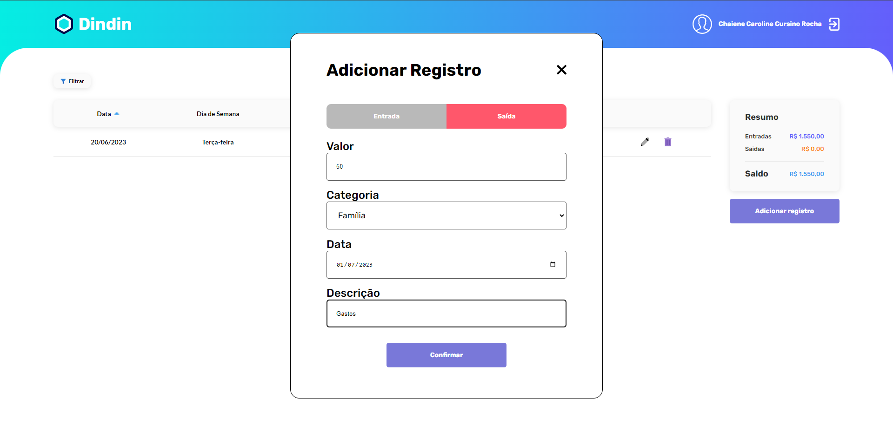

 
   
  

<h1 align='center'>Projeto DinDin</h1>

<h4 align="center"> 
	 💵 Projeto Dindin 💸 Concluído ✔️ 🚀 
</h4>
 
 

 <a href="#projeto">Projeto</a> •
 <a href="#aplicacao">Aplicação</a> • 
 <a href="#imagem">Layout</a> • 
 <a href="#instalacao">Instalação</a> • 
 <a href="#tecnologia">Tecnologias</a> • 
 <a href="#autor">Autor</a>

<a href='#projeto'><h2 style="font-family: sans-serif;">Sobre o projeto:</h2></a>

    O objetivo desse projeto foi desenvolver uma aplicação web utilizando o React e suas funcionalidades. Com essa magnífica biblioteca para web e interfaces de usuário nativas foi possível criar essa aplicação que se trata de um site <strong >aplicação para controle de finanças pessoais.</strong>. Para produzir o layout foi utilizado o arquivo figma.fig disponibilizado pela <strong >Cubos Academy</strong> na aula de desafios React, onde pude aprimorar e por em prática meus conhecimentos.

<a href='#aplicacao'><h2 style="font-family: sans-serif;">Sobre o Aplicação para controle de finanças pessoais:</h2></a>

    Trata - se de site de controle de entradas e despesas, na qual o usuário pode ter controle de suas finanças. Cadastrando as entradas e também as saídas, podendo excluir e até editar. Com ajuda de uma tabela de resumo, e possível administrar suas finanças e também é possível filtrar pelos métodos de categoria, assim podendo verificar os gastos conforme sua categoria.

<a href='#imagem'><h2 style="font-family: sans-serif;">Layout:</h2></a>

<a href='#instalacao'><h2 style="font-family: sans-serif;">Como utilizar os códigos desse repositório:</h2></a>

    Caso queira utilizar o código presente nesse repositório basta cloná-lo para sua máquina e utilizar o comando npm install no terminal do seu Editor de código para instalar node_modules e suas dependências. Após isso você poderá rodar a aplicação utilizando o comando npm start.

<a href='#tecnologia'><h2 style="font-family: sans-serif;">Tecnologias utilizadas</h2></a>

<ul>
    <li>React</li>
    <li>HTML(JSX)</li>
    <li>CSS</li>
    <li>JavaScript</li>
</ul>

<a href='#autor'><h2 style="font-family: sans-serif;">Autor do código</h2></a>

 
  
 <b>Chaiene Caroline</b>👾

Feito com ❤️ por Chaiene Caroline 😊 👋🏽 Entre em contato!

  

